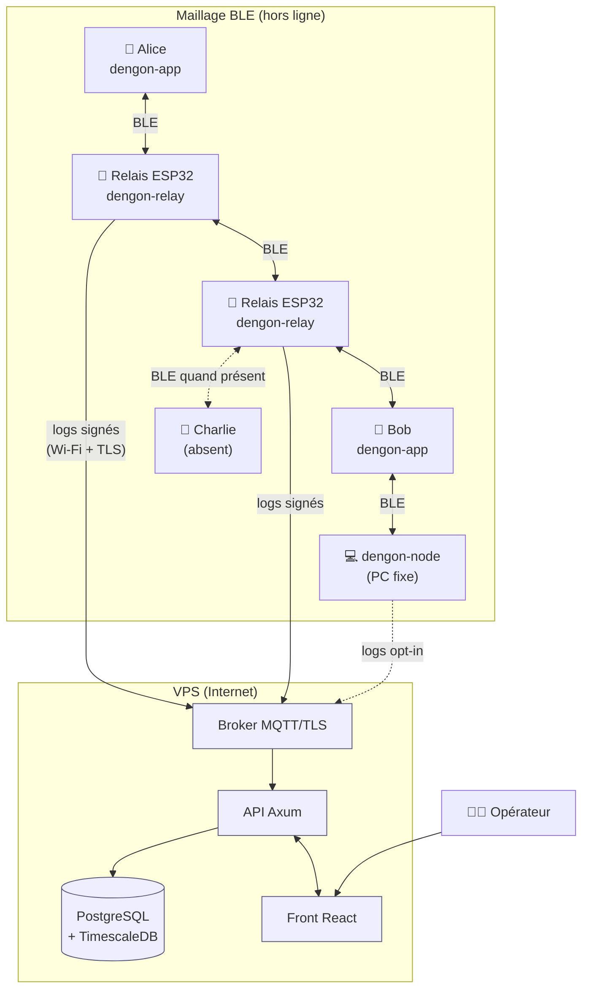

# dengon — Vue d'ensemble

> 伝言 (*dengon*) : « message que l'on confie à quelqu'un pour qu'il le transmette ».
> C'est exactement le principe du système : un message est confié au réseau, qui le
> porte de proche en proche jusqu'à son destinataire, même si personne n'a Internet.

---

## 1. Le problème

On veut échanger des messages texte **sans infrastructure réseau** (pas de 4G, pas de
Wi-Fi, pas de serveur de messagerie joignable) :

- lors d'un évènement où le réseau cellulaire est saturé ;
- dans une zone blanche ;
- en manifestation / catastrophe / festival ;
- par principe, pour une messagerie qui ne dépend d'aucun opérateur.

Le seul média disponible entre deux appareils proches est le **Bluetooth Low Energy
(BLE)**. Sa portée est courte (~10-30 m). Pour couvrir une distance utile, il faut un
**réseau maillé** : chaque appareil relaie les messages des autres.

Comme les appareils bougent, s'éteignent et sortent de portée en permanence, le
réseau n'est **jamais entièrement connecté**. Le système doit donc être
**tolérant aux délais et aux déconnexions** (*Delay-Tolerant Network*, DTN) : on
stocke, on transporte, on retransmet à la prochaine occasion.

---

## 2. La solution en une phrase

> Une messagerie **chiffrée de bout en bout** qui circule en **gossip** sur un
> **maillage BLE** de téléphones et de **relais ESP32** fixes, avec un
> **tableau de bord d'observabilité** sur VPS qui trace le parcours et l'état de
> chaque message **sans jamais voir son contenu**.

---

## 3. Les acteurs

| Acteur | Rôle | Matériel |
| --- | --- | --- |
| **Utilisateur** | écrit, envoie, lit des messages | smartphone (Android en MVP) |
| **App cliente** `dengon-app` | UI + nœud du réseau (émet, reçoit, relaie) | Android + cœur Rust partagé |
| **Nœud CLI** `dengon-node` | nœud sans UI : tests multi-nœuds, bootstrap, PC fixe | PC/Linux (Rust) |
| **Relais** `dengon-relay` | infrastructure fixe : relaie, met en cache, dépose, remonte les logs | ESP32-WROVER + Wi-Fi |
| **Dashboard** `dengon-dashboard` | observe le réseau, trace les messages, surveille la flotte | VPS (déjà possédé) |
| **Opérateur** | exploite le dashboard, surveille la santé du réseau | navigateur |

---

## 4. Cas d'usage MVP

1. **Envoi direct** : Alice et Bob sont à portée BLE → message livré en 1 saut.
2. **Envoi multi-saut** : Alice → Bob hors de portée, mais un relais ESP32 (ou un
   téléphone tiers) est entre les deux → le message est relayé.
3. **Destinataire absent** : Charlie est éteint. Le message est déposé sous forme
   d'**enveloppe scellée** sur des relais. Quand Charlie réapparaît, il la récupère.
4. **Expéditeur déconnecté** : Alice envoie puis coupe son BLE. À sa reconnexion,
   les **accusés** de distribution / lecture la rattrapent.
5. **Suivi** : l'opérateur ouvre le dashboard, cherche un `msgID`, voit le chemin
   parcouru et l'état courant (**en attente → parti → distribué → lu**).
6. **Vérification de contact** : Alice et Bob scannent mutuellement leur **QR code**
   et comparent un **code de vérification** à 60 chiffres pour se marquer « vérifiés ».

---

## 5. Périmètre

### Dans le MVP

- Messages **texte court** (< 1 Ko utile), 1-à-1.
- Chiffrement E2E (Noise) + signatures (Ed25519).
- Maillage BLE : émission, réception, relais multi-saut (flood contrôlé + TTL).
- Store-and-forward : outbox rejoué, enveloppes scellées, réconciliation gossip.
- 4 statuts + `échec/expiré`, avec accusés signés.
- Relais ESP32 fonctionnel (relais + cache + dépôt + shipping de logs).
- Dashboard : parcours d'un message, carte réseau, flotte de relais, recherche de
  logs, vérification d'intégrité des journaux chaînés.
- App Android.

### Hors MVP (prévu par l'architecture, pas livré)

- App iOS (le cœur Rust + UniFFI la rend possible ; BLE en fond est bridé sur iOS).
- Groupes / canaux publics de diffusion.
- Pièces jointes (images, fichiers).
- Ratchet façon Signal (montée en gamme du canal privé, forward secrecy renforcée).
- Firmware relais en Rust pur (`esp-rs`).
- Backhaul : le VPS **ne relaie pas** de messages (choix explicite : observabilité seule).

---

## 6. Schéma d'ensemble

Le trait plein = messages chiffrés (BLE). Le trait vers le VPS = **métadonnées
signées uniquement** — aucun contenu, aucun `msgID` en clair (haché).

---

## 7. Principes directeurs

1. **Offline-first** : toute fonction marche sans Internet ; la connectivité n'est
   qu'une opportunité, jamais un prérequis.
2. **Zéro confiance dans le transport** : les relais, le VPS et le réseau sont
   supposés hostiles → E2E systématique, métadonnées minimisées.
3. **Une seule implémentation du protocole** : `dengon-core` en Rust, partagé par
   l'app, le nœud CLI et (autant que possible) le firmware. Auditer une fois.
4. **Le dashboard observe, il n'agit pas** : il ne peut ni router, ni injecter, ni
   déchiffrer. S'il disparaît, le réseau fonctionne à l'identique.
5. **Traçabilité infalsifiable** : chaque nœud tient un journal chaîné signé ; le
   dashboard le vérifie mais ne peut pas le forger.

---

## 8. Matrice exigences → conception

| Exigence du brief | Traité dans |
| --- | --- |
| Envoyer des messages en Bluetooth | `03-network-protocol.md`, `05-message-lifecycle.md` |
| Sécuriser le message (« type blockchain ») | `01-benchmarks.md` §1, `04-security.md` |
| Recevoir un message en BT | `03-network-protocol.md` §GATT, `05-message-lifecycle.md` |
| Passage par le réseau BT (multi-saut) | `03-network-protocol.md` §Routage/TTL/gossip |
| Dashboard de suivi de logs sur VPS | `07-dashboard.md`, `08-observability-events.md` |
| Déconnexion non bloquante + rattrapage à la reconnexion | `05-message-lifecycle.md` §Reconnexion, `03` §Gossip |
| Statuts en attente / parti / distribué / lu + accusés | `05-message-lifecycle.md` §Machine à états |
| « Le réseau ressemble à une blockchain » | `01-benchmarks.md` §1 (analyse), `04-security.md` §Journal chaîné |
| Application au sein de l'ESP32 / système de relais | `06-relay-esp32.md` |
| Socle pour un vrai produit (sécurité, tests, CI) | `04-security.md` §Modèle de menace, `11-testing-strategy.md` |
| Contact par QR code + code de vérification | `04-security.md` §Identité & vérification |

---

## 9. Guide de lecture

| Vous voulez… | Lisez |
| --- | --- |
| comprendre les choix technos | `01-benchmarks.md` |
| voir comment c'est découpé | `02-architecture.md` |
| implémenter la couche réseau | `03-network-protocol.md` |
| implémenter la crypto | `04-security.md` |
| implémenter la logique de messages / statuts | `05-message-lifecycle.md` |
| coder le firmware ESP32 | `06-relay-esp32.md` |
| coder le dashboard | `07-dashboard.md` + `08-observability-events.md` |
| créer les schémas de BDD | `09-data-model.md` |
| savoir quoi livrer et dans quel ordre | `10-mvp-scope-roadmap.md` |
| mettre en place les tests / la CI | `11-testing-strategy.md` |
