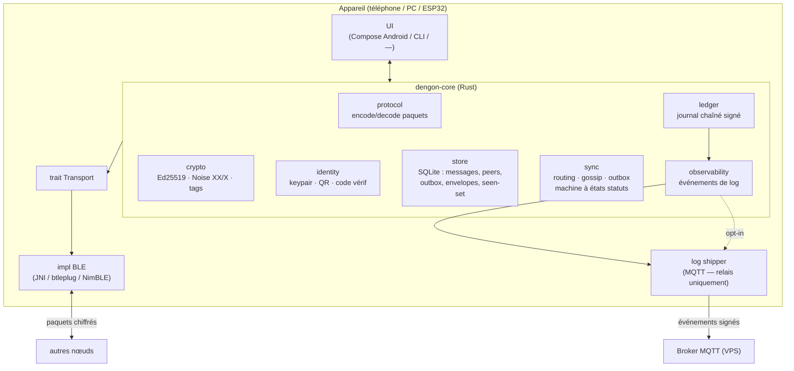
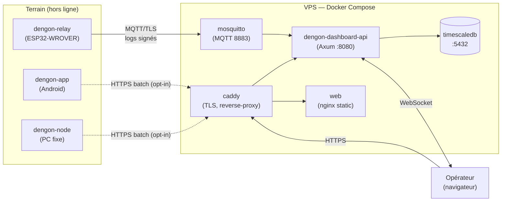

# Architecture

## 1. Vue composants



`dengon-core` ne connaît **jamais** la radio : il produit/consomme des `Vec<u8>` que
le `Transport` transporte. Il ne connaît **jamais** le réseau IP : le `log shipper`
est un consommateur externe du flux d'événements.

---

## 2. `dengon-core` — modules

| Module | Responsabilité | Dépendances clés |
| --- | --- | --- |
| `protocol` | sérialisation binaire des paquets (cf. `03`), types, flags, fragmentation/réassemblage | — (`no_std` compatible) |
| `crypto` | Ed25519 (sign/verify), Noise `XX` & `X` (`snow`), scellage d'enveloppes, `recipient_tag`, padding | `ed25519-dalek`, `snow`, `x25519-dalek`, `chacha20poly1305`, `hmac`, `sha2` |
| `identity` | génération/chargement de l'identité, encodage QR, dérivation du code de vérification 60 chiffres | `crypto`, `qrcode` (côté app) |
| `store` | persistance : messages, conversations, contacts, outbox, enveloppes, seen-set, journal | `rusqlite` (natif) / abstraction pour ESP32 |
| `sync` | routage (flood + TTL + jitter), réconciliation gossip (filtres), rejeu d'outbox, **machine à états des statuts**, collecte d'enveloppes | `protocol`, `store`, `crypto` |
| `ledger` | journal append-only chaîné : `append(event) -> Entry`, `verify_chain()`, `export(range)` | `crypto`, `sha2` |
| `observability` | catalogue d'événements typés, sérialisation JSON canonique, redaction (hachage `msgID`) | `serde`, `ledger` |
| `api` (façade) | surface publique exposée à l'UI et à UniFFI : `send_message`, `poll_events`, `on_peer_connected(transport)`, `mark_read`, … | tous les autres |

### Frontières `no_std`

Pour la cible ESP32, `protocol`, `sync` (routage/dedup/gossip), `ledger` doivent
compiler en `no_std` + `alloc`. `store` est derrière un trait `Store` (impl `rusqlite`
natif, impl NVS/flash sur ESP32). `crypto` : voir `01-benchmarks.md` §4.2 (décision au
spike du lot 0).

---

## 3. Le trait `Transport`

```rust
/// Abstraction d'un lien BLE. Implémentée nativement par plateforme.
pub trait Transport: Send {
    /// Démarre l'annonce du service `dengon` + le scan des pairs.
    fn start(&mut self, cfg: TransportConfig) -> Result<()>;

    /// Événements remontés vers le core (thread-safe, non bloquant).
    ///  - PeerConnected { peer_link_id, rssi }
    ///  - PeerDisconnected { peer_link_id }
    ///  - FrameReceived { peer_link_id, bytes }   // 1 trame BLE (déjà réassemblée L2)
    fn poll(&mut self) -> Vec<TransportEvent>;

    /// Envoie une trame applicative à un pair connecté.
    /// La fragmentation BLE (MTU) est gérée par l'impl ; la fragmentation
    /// protocole (paquets > MTU) est gérée par `protocol`.
    fn send(&mut self, peer_link_id: LinkId, bytes: &[u8]) -> Result<()>;

    /// Diffusion best-effort à tous les pairs connectés (pour ANNOUNCE, gossip).
    fn broadcast(&mut self, bytes: &[u8]) -> Result<()>;
}
```

| Impl | Fichier | Techno |
| --- | --- | --- |
| Android | `android/.../ble/AndroidTransport.kt` + pont JNI dans `dengon-ffi` | `BluetoothGattServer`, `BluetoothLeScanner`, `BluetoothGatt` |
| Desktop / CLI | `crates/dengon-ble/src/btleplug_transport.rs` | `btleplug` (BlueZ / CoreBluetooth / WinRT) |
| ESP32 | `firmware/dengon-relay/src/transport_nimble.c` (+ FFI vers la lib core) | NimBLE (ESP-IDF) |

Le **rôle GATT** : chaque nœud est **serveur ET client**. Service `dengon`
(UUID fixe), 2 caractéristiques : `RX` (write-without-response, pair → nœud),
`TX` (notify, nœud → pair). Détails GATT : `03-network-protocol.md` §6.

---

## 4. Découpage du dépôt

```text
dengon/
├── crates/
│   ├── dengon-core/          # lib Rust — LE protocole (cf. §2)
│   │   ├── src/{protocol,crypto,identity,store,sync,ledger,observability,api}.rs
│   │   └── tests/            # tests unitaires + property tests
│   ├── dengon-ble/           # trait Transport + impl btleplug
│   ├── dengon-node/          # binaire CLI : nœud headless (tests, PC fixe, bootstrap)
│   │   └── src/main.rs       # `dengon-node run --name alice --db ./alice.db`
│   ├── dengon-sim/           # simulateur multi-nœuds (transport in-memory, partitions) — cf. 11
│   └── dengon-ffi/           # bindings UniFFI (génère Kotlin + Swift)
│
├── android/                  # app Kotlin + Jetpack Compose
│   └── app/src/main/{java,kotlin}/…/{ble,ui,service}/
│
├── firmware/
│   └── dengon-relay/         # ESP-IDF (C) + NimBLE + client MQTT/TLS + lib core statique
│       ├── main/
│       └── components/dengon_core_ffi/
│
├── dashboard/
│   ├── api/                  # Axum : consumer MQTT + REST + WebSocket + vérif hash-chain
│   ├── web/                  # React + TS + Vite
│   └── deploy/               # docker-compose.yml, Caddyfile, migrations SQL
│
├── docs/powl/                # cette conception
└── Cargo.toml                # workspace Rust (crates/* + dashboard/api)
```

---

## 5. Déploiement



- Le VPS n'a **aucune** connexion sortante vers le terrain. Il **reçoit** seulement.
- Perte du VPS = perte de l'observabilité, **zéro impact** sur la messagerie.
- Relais authentifiés par **mTLS** (certificat client par relais) ou JWT signé ;
  clients opt-in par token éphémère.

---

## 6. Flux de données — cycle de vie d'un envoi (résumé)

```mermaid
sequenceDiagram
    participant U as UI
    participant C as dengon-core
    participant T as Transport (BLE)
    participant P as Pair / Relais

    U->>C: send_message(dest, "salut")
    C->>C: crypto: sceller (Noise X) + signer (Ed25519)
    C->>C: store: outbox.insert(status=en_attente)
    C->>C: ledger.append(msg.queued) ; observability
    Note over C: attend un pair
    T-->>C: PeerConnected(link)
    C->>C: handshake Noise XX si besoin
    C->>C: gossip: réconciliation des msgID
    C->>T: send(link, paquet)
    T->>P: paquet chiffré
    C->>C: outbox.status = parti ; ledger.append(msg.handed_off)
    P-->>T: ACK signé (plus tard, via gossip)
    T-->>C: FrameReceived(ACK)
    C->>C: outbox.status = distribué ; ledger.append(msg.delivered)
    U->>C: (destinataire lit) -> read receipt
    C->>C: status = lu ; ledger.append(msg.read)
```

Détail complet, y compris reconnexion et enveloppes scellées : `05-message-lifecycle.md`.

---

## 7. Choix transverses

| Sujet | Choix | Note |
| --- | --- | --- |
| Langage cœur | Rust (edition 2021, MSRV figée) | audit unique |
| Async | `tokio` côté `dengon-node`/dashboard ; core = **sync + boucle d'événements** (portable ESP32) | le core n'impose pas de runtime |
| Sérialisation événements | JSON canonique (clés triées) pour la signature ; stockage tel quel | déterminisme de signature |
| Sérialisation paquets | binaire maison (cf. `03`) | compacité BLE |
| Base locale | SQLite (`rusqlite`, `WAL`) | chiffrée au repos via SQLCipher (option) ou champ-par-champ |
| ID de log | `msgID` haché (`SHA-256(msgID_brut)[:16]`) avant tout envoi au VPS | anti-corrélation |
| Versionnement protocole | champ `version` dans chaque paquet + négociation à l'ANNOUNCE | montée de version progressive |
