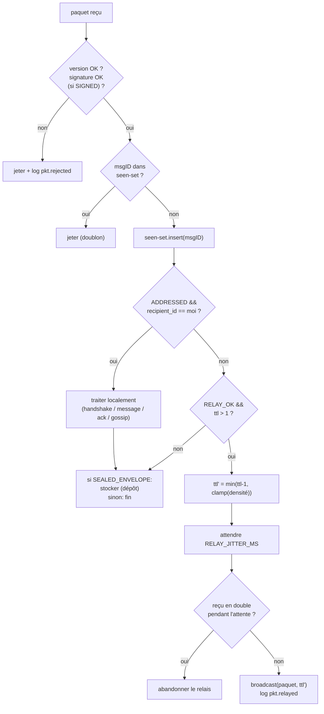

# Protocole réseau

Ce document est la **source de vérité** du format binaire et des règles de routage.
Toute autre partie (firmware, dashboard) recopie ces constantes à l'identique.

---

## 1. Couches

```text
┌─────────────────────────────────────────────┐
│ L4  Application : Message, Ack, ReadReceipt  │  ← contenu chiffré (Noise)
├─────────────────────────────────────────────┤
│ L3  Enveloppe dengon : Packet (signé)       │  ← ce document
│     routage, TTL, dedup, gossip              │
├─────────────────────────────────────────────┤
│ L2  Fragmentation protocole (paquet > MTU)   │  ← ce document §5
├─────────────────────────────────────────────┤
│ L1  BLE GATT (RX/TX characteristics)         │  ← ce document §6
└─────────────────────────────────────────────┘
```

---

## 2. Constantes (`protocol::consts`)²³

| Nom | Valeur | Sens |
| --- | --- | --- |
| `PROTO_VERSION` | `1` | version courante |
| `SERVICE_UUID` | `6d656e67-2d64-656e-676f-6e2d76310000` (`"meng-den gon-v1"`) | service GATT `dengon` |
| `CHAR_RX_UUID` | `…0001` | write-without-response, pair → nœud |
| `CHAR_TX_UUID` | `…0002` | notify, nœud → pair |
| `TTL_DEFAULT` | `7` | sauts au départ |
| `TTL_CLAMP_DENSE` | `5` | si ≥ `DENSE_LINKS` voisins |
| `DENSE_LINKS` | `6` | seuil de densité |
| `THIN_LINKS` | `2` | seuil « chaîne fine » (relais à profondeur pleine) |
| `RELAY_JITTER_MS` | `10..=220` | délai aléatoire avant relais |
| `SEEN_SET_CAP` | `1024` | entrées LRU |
| `SEEN_TTL_S` | `300` | expiration d'une entrée |
| `FRAG_SIZE` | `440` | octets de payload par fragment |
| `FRAG_TIMEOUT_S` | `30` | abandon du réassemblage |
| `FRAG_MAX_CONCURRENT` | `64` | assemblages simultanés |
| `MSG_TTL_S` | `86_400` | durée de vie applicative d'un message (24 h) |
| `ENVELOPE_MAX_BYTES` | `4096` | taille max d'une enveloppe scellée (texte court) |
| `COPY_BUDGET_INIT` | `4` | copies initiales d'une enveloppe |
| `COPY_BUDGET_MAX` | `8` | plafond |
| `PAD_BUCKETS` | `[256, 512, 1024, 2048]` | tailles cibles des paquets chiffrés |
| `ANNOUNCE_ISOLATED_S` | `4` | période d'ANNOUNCE si seul |
| `ANNOUNCE_CONNECTED_S` | `15..=30` | période d'ANNOUNCE si connecté (jitter) |

---

## 3. Format du paquet L3

Tous les entiers sont **big-endian**.

```text
 offset  taille  champ
 ------  ------  --------------------------------------------------
   0       1     version            (= PROTO_VERSION)
   1       1     type               (cf. §4)
   2       1     ttl                 (décrémenté à chaque relais)
   3       1     flags              (bitfield, cf. §3.1)
   4       8     timestamp_ms        (UTC ms, horloge de l'émetteur)
  12       8     sender_id           (peerID = SHA-256(pub_static)[0..8])
  20      [8]    recipient_id        (présent SSI flags.ADDRESSED)
  20|28    2     payload_len         (N)
  22|30    N     payload             (cf. §4 selon type)
  +N      [64]   signature           (présent SSI flags.SIGNED ; Ed25519 sur
                                      octets [0 .. début_signature])
```

Taille d'en-tête : 22 o (broadcast) ou 30 o (adressé). Avec signature : +64 o.

### 3.1 `flags` (bitfield)

| bit | nom | sens |
| --- | --- | --- |
| 0 | `ADDRESSED` | `recipient_id` présent ; paquet à destination d'un `peerID` précis |
| 1 | `SIGNED` | signature Ed25519 en fin de paquet |
| 2 | `FRAGMENT` | le payload est un fragment (cf. §5) — l'en-tête L3 enveloppe le fragment |
| 3 | `RELAY_OK` | l'émetteur autorise le relais (0 = strictement local, 1 saut) |
| 4 | `PADDED` | le payload est complété par du PKCS#7 vers un `PAD_BUCKET` |
| 5-7 | réservé | 0 |

### 3.2 `msgID` (identifiant de contenu)

```text
msgID = SHA-256( sender_id ‖ timestamp_ms ‖ type ‖ payload )   // 32 o
```

- sert de clé de **déduplication** (via le seen-set) ;
- sert de **référence de suivi** (l'app l'affiche, le dashboard le trace **haché** :
  `msgID_log = SHA-256(msgID)[0..16]`) ;
- rend le paquet **idempotent** : le rejouer n'a aucun effet.

---

## 4. Types de paquets

| `type` | nom | `ADDRESSED` | `SIGNED` | payload |
| --- | --- | --- | --- | --- |
| `0x01` | `ANNOUNCE` | non | oui | `peerID ‖ pub_static(32) ‖ pub_sign(32) ‖ pseudo_len(1) ‖ pseudo ‖ ledger_height(8) ‖ caps(1)` |
| `0x02` | `NOISE_HS` | oui | non | message de handshake Noise `XX` (1 des 3 messages) |
| `0x03` | `NOISE_MSG` | oui | non | ciphertext Noise (transport) ; en clair : un `AppFrame` (§4.1) |
| `0x04` | `SEALED_ENVELOPE` | non | oui | `recipient_tag(16) ‖ epoch_day(2) ‖ noise_x_ciphertext` ; en clair : `AppFrame` |
| `0x05` | `ACK` | oui | non | (dans session Noise) `AckFrame` (§4.1) |
| `0x06` | `GOSSIP_FILTER` | oui | oui | `kind(1) ‖ golomb_coded_set` — résumé compact des `msgID` connus |
| `0x07` | `GOSSIP_PULL` | oui | oui | `count(2) ‖ msgID[count]` — demande explicite de paquets |
| `0x08` | `GOSSIP_PUSH` | oui | no | `count(2) ‖ (len(2) ‖ packet)[count]` — paquets bruts ré-encapsulés |
| `0x09` | `FRAGMENT` | hérite | non | cf. §5 |
| `0x0A` | `LOG_ATTEST` | non | oui | `ledger_root(32) ‖ height(8) ‖ node_pub_sign(32)` — attestation de journal (diffusée, captée par relais → VPS) |
| `0x0B` | `ENVELOPE_OFFER` | oui | oui | `count(2) ‖ recipient_tag(16)[count]` — « je porte ces enveloppes » |
| `0x0C` | `ENVELOPE_REQUEST` | oui | oui | `count(2) ‖ recipient_tag(16)[count]` — « donne-les moi » |

### 4.1 Frames applicatives (L4, à l'intérieur de Noise)

```text
AppFrame  = kind(1) ‖ body
  kind 1 : Message   -> msg_uuid(16) ‖ conv_seq(8) ‖ sent_ms(8) ‖ text_utf8
  kind 2 : Ack       -> AckFrame
  kind 3 : ReadRcpt  -> msg_uuid(16) ‖ read_ms(8)
  kind 4 : Profile    -> pseudo, avatar_hash… (post-MVP)

AckFrame  = msg_uuid(16) ‖ status(1) ‖ at_ms(8)
  status : 2=distribué (reçu par l'appareil destinataire)
```

- `msg_uuid` : UUIDv4 tiré par l'émetteur, **stable de bout en bout** ; c'est lui que
  la machine à états des statuts suit (le `msgID` L3 change si le paquet est
  re-scellé). Voir `05-message-lifecycle.md`.
- `conv_seq` : compteur par conversation → détection de trous, ordre causal.

---

## 5. Fragmentation protocole (L2)

Nécessaire quand un paquet L3 dépasse le MTU ATT négocié (souvent 185-244 o utiles,
jusqu'à 517 si négocié). Le **texte court** tient généralement en 1 paquet ; la
fragmentation sert surtout aux `GOSSIP_PUSH` et aux enveloppes.

```text
Fragment payload (dans un paquet type=0x09, flags.FRAGMENT) :
  frag_id(8)     = SHA-256(paquet_complet)[0..8]
  index(2)
  total(2)
  chunk(<= FRAG_SIZE)
```

- Réassemblage : buffer par `frag_id`, complété quand les `total` chunks sont là.
- `FRAG_TIMEOUT_S` d'inactivité → abandon. `FRAG_MAX_CONCURRENT` dépassé → on jette
  le plus ancien.
- Un fragment **n'est pas signé** individuellement ; la signature est dans le paquet
  reconstruit.

---

## 6. Couche BLE (L1)

### 6.1 Rôle double

Chaque nœud, en permanence :

- **Peripheral** : publie le service `SERVICE_UUID`, expose `CHAR_RX` (write w/o
  response) et `CHAR_TX` (notify). Annonce un *manufacturer data* court =
  `peerID[0..4] ‖ flags` (aide au filtrage de scan).
- **Central** : scanne le `SERVICE_UUID`, se connecte aux nouveaux `peerID`, s'abonne
  à leur `CHAR_TX`.

Règle anti-boucle de connexion : quand A et B se découvrent, **celui dont le `peerID`
est le plus petit** initie la connexion GATT (l'autre attend).

### 6.2 Envoi d'un paquet

1. `protocol::encode(packet)` → octets.
2. Si `len > MTU_util` → fragmentation L2 (§5) → suite de paquets `0x09`.
3. Pour chaque paquet : write sur `CHAR_RX` du pair (central→peripheral) **ou**
   notify sur notre `CHAR_TX` (peripheral→central).
4. `Transport::send` gère le découpage **BLE** (MTU) de façon transparente ; la
   fragmentation **protocole** (§5) est déjà faite en amont.

### 6.3 MTU

Négocier `ATT_MTU = 517` à la connexion ; retomber sur 23 (→ 20 o utiles) si refus.
`Transport` expose le MTU effectif ; `protocol` l'utilise pour décider la
fragmentation L2.

---

## 7. Routage : flood contrôlé + gossip

### 7.1 À la réception d'un paquet



- **Directed traffic** (`NOISE_HS`, `NOISE_MSG`, `ACK`, `SEALED_ENVELOPE`,
  `GOSSIP_*`) : relais déterministe `ttl-1`, jitter serré, **pas de fanout partiel**
  (on rediffuse à tous les pairs sauf celui d'où ça vient).
- **Broadcast** (`ANNOUNCE`, `LOG_ATTEST`) : idem mais TTL faible (2-3).

### 7.2 Réconciliation gossip (à chaque nouveau pair)

Après ANNOUNCE + handshake :

1. Chacun envoie un `GOSSIP_FILTER` (Golomb-Coded Set des `msgID` qu'il détient dans
   son cache : messages publics récents, ACK non encore confirmés livrés, enveloppes).
2. Chacun calcule ce que l'autre ne semble pas avoir → envoie `GOSSIP_PULL` (liste de
   `msgID`) ou directement `GOSSIP_PUSH` si peu de paquets.
3. L'autre répond `GOSSIP_PUSH` avec les paquets bruts.
4. Les paquets poussés repassent par le pipeline §7.1 (donc re-déduplication, re-vérif
   de signature, éventuel re-relais).

GCS choisi plutôt qu'un Bloom filter : ~20-30 % plus compact à même taux de
faux-positifs, ce qui compte sur BLE. Paramètre `p = 1/64`.

### 7.3 Collecte d'enveloppes scellées

À chaque rencontre :

1. Le porteur d'enveloppes envoie `ENVELOPE_OFFER` (liste de `recipient_tag`).
2. Le pair calcule **ses** tags du jour (± 1 jour de fenêtre) :
   `HMAC(ma_pub_static, jour)` et compare.
3. Match → `ENVELOPE_REQUEST` → le porteur renvoie le `SEALED_ENVELOPE`.
4. Le destinataire déchiffre (Noise `X`), traite le message, émet un `ACK`.
5. **Budget de copies** : quand deux porteurs d'une même enveloppe se rencontrent,
   ils se partagent la moitié du budget restant (Spray-and-Wait). Budget épuisé +
   `MSG_TTL_S` dépassé → suppression.

---

## 8. Anti-abus / robustesse

| Menace | Contre-mesure |
| --- | --- |
| Rejeu de paquets | `msgID` + seen-set ; `timestamp_ms` hors fenêtre ±2 h → rejeté |
| Boucle de flood | seen-set + TTL + jitter + abandon si doublon pendant l'attente |
| Paquet forgé (usurpation d'émetteur) | `ANNOUNCE`/`GOSSIP`/`ENVELOPE`/`LOG_ATTEST` signés ; `peerID` doit matcher `SHA-256(pub_static)` |
| Flood volontaire (DoS) | quota par `peerID` et par lien (paquets/s) ; RSSI-gating ; on relaie au plus `TTL_DEFAULT` copies |
| Épuisement mémoire (fragments / enveloppes) | caps stricts (`FRAG_MAX_CONCURRENT`, `ENVELOPE` par nœud), éviction LRU |
| Analyse de trafic par un relais | padding `PAD_BUCKETS` ; `recipient_tag` tournant ; pas de `recipient_id` sur les enveloppes |
| Horloge fausse d'un nœud | fenêtre de tolérance ; le dashboard signale les dérives (`node.clock_skew`) |

---

## 9. Exemple concret (texte « salut » d'Alice à Bob, connectés)

```text
ANNOUNCE échangés → handshake Noise XX (3 × NOISE_HS) → session établie.
Alice: AppFrame{kind=1, msg_uuid=U, conv_seq=42, "salut"}
     → chiffré Noise → NOISE_MSG{ADDRESSED bob, payload=ct}
     → encode L3 (30 o en-tête + ct) → 1 write sur CHAR_RX de Bob.
Bob: déchiffre, stocke, affiche, émet AppFrame{kind=2, Ack{U, status=2}}
   → NOISE_MSG{ADDRESSED alice} → notify.
Alice: statut de U → distribué.
Bob lit → AppFrame{kind=3, ReadRcpt{U}} → Alice: statut → lu.
```

Cf. `05-message-lifecycle.md` pour les cas déconnecté / multi-saut / enveloppe.
