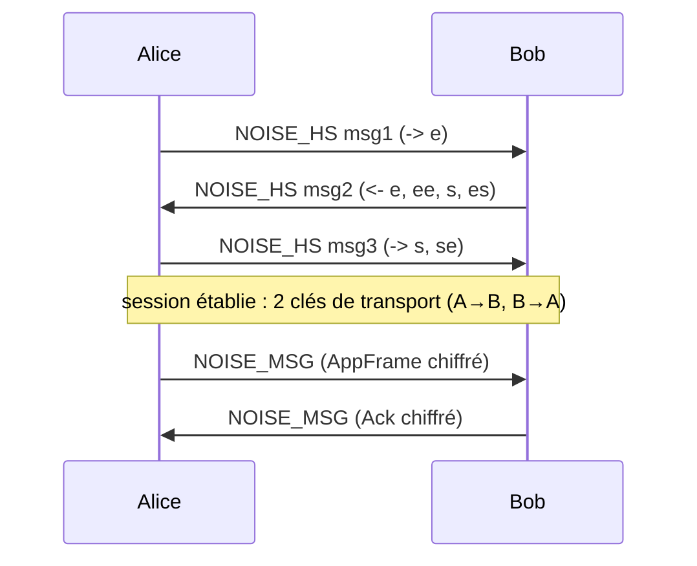

# Sécurité

## 1. Modèle de menace

### 1.1 Ce qu'on protège

| Actif | Objectif de sécurité |
| --- | --- |
| Contenu des messages | **confidentialité** (seul le destinataire lit) + **intégrité** + **authenticité** |
| Qui parle à qui | **minimisation** (les relais et le VPS ne doivent pas savoir) |
| Statuts / accusés | intégrité + authenticité (pas de faux « lu ») |
| Journal d'activité d'un nœud | **infalsifiabilité** *a posteriori* (tamper-evident) |
| Identité d'un contact | **non-usurpable** ; vérifiable hors bande |

### 1.2 Attaquants considérés

| Attaquant | Capacités supposées | Traité par |
| --- | --- | --- |
| **Relais malveillant** (ESP32 compromis / faux relais) | voit tout le trafic BLE qui passe, peut jeter / dupliquer / réordonner, peut mentir au VPS | E2E Noise, padding, tags tournants, journal chaîné signé (le VPS recoupe) |
| **VPS compromis / administrateur curieux** | voit tous les logs, la BDD, peut les modifier | aucune clé privée ni clair ne transite ; `msgID` haché ; signatures vérifiables côté client |
| **Voisin BLE passif** | sniffe l'air | chiffrement + padding ; `peerID` stable mais pseudonyme |
| **Attaquant actif MITM au premier contact** | intercepte l'échange de clés | vérification **QR + code 60 chiffres** hors bande ; TOFU sinon |
| **Vol de l'appareil déverrouillé** | accès à la base locale | chiffrement au repos (SQLCipher / Keystore) ; *panic wipe* (post-MVP) |
| **Attaquant réseau global** | corrèle les métadonnées à grande échelle | hors périmètre MVP (documenté comme limite) |

### 1.3 Hors périmètre (assumé)

- Résistance à un adversaire étatique faisant de l'analyse de trafic mondiale.
- Déni de service radio (brouillage BLE) — non soluble au niveau protocole.
- Forward secrecy des **enveloppes scellées** (cf. §3.3).
- Sécurité physique de l'ESP32 (extraction de sa clé de relais → au pire, faux logs,
  jamais de déchiffrement de messages).

---

## 2. Identité

### 2.1 Clés

Chaque installation génère, au premier lancement, et stocke dans le coffre de la
plateforme (Android Keystore / Secret Service / NVS chiffrée ESP32) :

| Clé | Algo | Usage |
| --- | --- | --- |
| `static` | X25519 (Curve25519) | accord de clés Noise (`XX` et `X`) |
| `sign` | Ed25519 | signature des paquets `ANNOUNCE`, `GOSSIP_*`, `SEALED_ENVELOPE`, `LOG_ATTEST` |

```
peerID = SHA-256(pub_static)[0..8]          // 8 octets, affiché en base32
fingerprint = SHA-256(pub_static ‖ pub_sign) // 32 octets, base de la vérification
```

`peerID` est **stable** entre redémarrages et réinstallations tant que le coffre
survit. Il ne change qu'après régénération explicite (« nouvelle identité »).

### 2.2 QR code

```
dengon:v1:<base64url( pseudo_len(1) ‖ pseudo ‖ pub_static(32) ‖ pub_sign(32) )>
```

Affiché par l'app ; scanné par le correspondant. Contient tout le nécessaire pour
chiffrer et vérifier. Pas de secret.

### 2.3 Code de vérification (« safety number »)

Objectif : détecter un MITM au premier contact **sans dépendre d'un serveur**.

```
material = SHA-512( min(fpA, fpB) ‖ max(fpA, fpB) )   // ordre-indépendant
code = 60 chiffres décimaux :
       pour i in 0..12 : groupe_i = ( u16_be(material[i*2 .. i*2+2]) % 100000 )
       affiché : "01234 56789 01234 ..." (12 groupes de 5)
```

- Les deux appareils affichent **le même code**.
- L'utilisateur compare visuellement (ou le lit à voix haute).
- Match → contact marqué **✔ vérifié** (stocké dans `contacts.verified_at`).
- Non-vérifié → **TOFU** : on fait confiance à la première clé vue pour ce `peerID`,
  et on **alerte** si elle change ensuite (`contacts.key_changed`).

### 2.4 Changement de clé

Si un `ANNOUNCE` présente un `pub_static` différent pour un `peerID`/pseudo connu :

- message livrés **suspendus** vers ce contact ;
- bannière UI « la clé de X a changé — re-vérifiez » ;
- l'événement `contact.key_changed` est journalisé (chaîne locale).

---

## 3. Chiffrement des messages

### 3.1 Session en direct — Noise `XX`

Motif : `Noise_XX_25519_ChaChaPoly_SHA256`.



- **Authentification mutuelle** : chacun prouve la possession de sa clé `static`.
- **Forward secrecy** : clés éphémères `e` ; compromettre `static` plus tard ne
  déchiffre pas les sessions passées.
- Vérification : la `pub_static` reçue dans le handshake **doit** correspondre à
  celle du contact (vérifié ou TOFU). Sinon → handshake rejeté, alerte.
- Durée de vie de session : réutilisée tant que le lien BLE tient ; re-négociée à la
  reconnexion (nouvelle FS) ou après `2^n` messages / rekey Noise.
- **ACK et read-receipts** voyagent **dans** la session (chiffrés, authentifiés).

### 3.2 Message pour destinataire absent — Noise `X` (enveloppe scellée)

Motif : `Noise_X_25519_ChaChaPoly_SHA256` (one-shot, expéditeur → clé statique du
destinataire).

```
SEALED_ENVELOPE.payload =
    recipient_tag(16) ‖ epoch_day(2) ‖ noise_x_message
noise_x_message chiffre : AppFrame{kind=1, Message{...}} ‖ sender_pub_static(32) ‖ sig
```

- Le destinataire peut déchiffrer avec sa clé `static` **hors ligne, plus tard**.
- Le paquet `SEALED_ENVELOPE` est **signé Ed25519** par l'expéditeur (le relais
  vérifie la signature avant de stocker → anti-pollution).
- `sender_pub_static` est **à l'intérieur** du chiffré → un relais ne sait pas qui
  envoie.

### 3.3 Adressage anonyme — `recipient_tag`

```
recipient_tag(day) = HMAC-SHA256( pub_static_destinataire , "dengon-tag" ‖ day_u32 )[0..16]
```

- Change chaque jour → un relais ne peut pas suivre un destinataire dans le temps.
- Le destinataire calcule ses propres tags (jour J, J-1, J+1) et matche les
  `ENVELOPE_OFFER`.
- Un relais qui stocke 100 enveloppes voit 100 tags **non corrélables** entre eux ni
  à une identité.

**Limite assumée** : pas de forward secrecy sur les enveloppes. Si la clé `static`
du destinataire est volée **avant** qu'il ait récupéré une enveloppe encore en
circulation, cette enveloppe est déchiffrable. Mitigation : `MSG_TTL_S` = 24 h borne
la fenêtre. Montée en gamme possible (pré-clés type X3DH) en v2.

### 3.4 Padding

Tout paquet `NOISE_MSG` / `NOISE_HS` / `SEALED_ENVELOPE` est complété (PKCS#7, flag
`PADDED`) à la borne supérieure de `PAD_BUCKETS = [256, 512, 1024, 2048]`. Un message
« ok » et un message de 200 caractères sont indistinguables par la taille.

---

## 4. Journal chaîné signé (la couche « type blockchain »)

### 4.1 But

Donner au dashboard — et à un auditeur — une **trace infalsifiable** de ce que chaque
nœud a fait, **sans** que le dashboard puisse la forger et **sans** consensus.
C'est un *hash-chained append-only log*, pas une blockchain répliquée (cf.
`01-benchmarks.md` §1).

### 4.2 Structure

```
Entry {
    seq:        u64          // 0, 1, 2, … monotone, sans trou
    ts_ms:      u64
    event:      string       // nom canonique (cf. 08-observability-events.md)
    payload:    object       // champs de l'événement, msgID déjà haché
    prev_hash:  bytes32      // hash de l'entrée seq-1  (00…0 pour seq 0)
}
entry_hash = SHA-256( canonical_json(Entry) )
Record {
    entry:  Entry
    hash:   entry_hash
    sig:    Ed25519( sign_key , entry_hash )
}
```

- `canonical_json` : clés triées, pas d'espaces, UTF-8, entiers sans zéro superflu.
- Le journal est **local** à chaque nœud (client et relais).
- `ledger_root` = `entry_hash` de la dernière entrée = résumé de tout l'historique.

### 4.3 Attestation (`LOG_ATTEST`)

Périodiquement, chaque nœud **diffuse** en BLE un paquet `LOG_ATTEST` signé :
`{ ledger_root, height, node_pub_sign }`. Les relais le captent et le remontent au
VPS. Effet : le VPS voit la « hauteur » revendiquée par chaque nœud, **corroborée par
des tiers** (plusieurs relais rapportent la même racine).

### 4.4 Vérifications côté dashboard

| Contrôle | Détecte |
| --- | --- |
| `prev_hash(seq) == hash(seq-1)` sur toute la séquence reçue | **altération** d'une entrée passée |
| `seq` strictement croissante sans trou | **suppression** d'entrées |
| `sig` valide avec `node_pub_sign` | entrée **forgée** par un tiers (ou le VPS) |
| `ledger_root` reçu ≥ `ledger_root` précédent, et cohérent avec les `LOG_ATTEST` de plusieurs relais | **fork** (le nœud sert deux historiques différents) |
| recoupement : même `msgID_log` rapporté par relais R1 et R2 avec des `prev_hop` cohérents | relais qui **ment** sur un relais |

Une rupture → alerte `integrity.chain_broken` / `integrity.fork_detected` dans le
dashboard, nœud marqué « suspect ». **Le dashboard ne peut pas réparer ni réécrire**
un journal : il constate.

### 4.5 Ce que le journal **ne** fait **pas**

- pas d'ordre total entre nœuds (chaque journal est indépendant) ;
- pas de preuve que le nœud a **tout** journalisé (il peut omettre *avant* de signer
  seq n) — d'où le **recoupement multi-relais** comme garde-fou ;
- pas de valeur / pas de double-dépense → pas de consensus nécessaire.

---

## 5. Sécurité des relais ESP32

| Aspect | Choix |
| --- | --- |
| Clé de relais | paire Ed25519 propre, générée à la prod, stockée en **NVS chiffrée** (eFuse flash encryption activé) |
| Enregistrement | `pub_sign` du relais déclarée au dashboard (liste blanche) ; mTLS pour MQTT |
| Compromission physique | **aucune clé utilisateur** sur le relais → pas de déchiffrement possible. Au pire : faux logs (détectés par recoupement), rétention/drop de paquets (le réseau route autour) |
| Mise à jour firmware | OTA signé (signature vérifiée par le bootloader) — post-MVP |
| Secure Boot | activé sur les cartes de prod |

---

## 6. Sécurité du dashboard

| Aspect | Choix |
| --- | --- |
| Données au repos | aucun clair de message ; `msgID` haché ; pseudos affichés seulement si le nœud les publie (opt-in) |
| Transport | TLS partout (Caddy + Let's Encrypt) ; MQTT sur 8883 TLS |
| Auth relais | mTLS (cert client par relais) **ou** JWT signé court |
| Auth opérateurs | login + argon2id + TOTP ; rôles `viewer` / `admin` |
| Injection | le dashboard **n'a aucun chemin d'écriture vers le terrain** ; API terrain = *ingest only* |
| Rétention | événements purgés après N jours (config, défaut 90) ; agrégats conservés |
| Audit interne | actions opérateurs journalisées |

---

## 7. Cryptographie — choix de primitives

| Fonction | Primitive | Crate Rust |
| --- | --- | --- |
| Signature | Ed25519 | `ed25519-dalek` v2 |
| Accord de clés | X25519 | `x25519-dalek` |
| Framework de session | Noise `XX` / `X` | `snow` |
| AEAD | ChaCha20-Poly1305 | `chacha20poly1305` (via `snow`) |
| Hash | SHA-256 / SHA-512 | `sha2` |
| MAC (tags) | HMAC-SHA256 | `hmac` |
| KDF (au besoin) | HKDF-SHA256 | `hkdf` |
| Aléa | OS CSPRNG | `getrandom` / `rand_core::OsRng` |
| Base locale chiffrée | SQLCipher (AES-256) ou champ-par-champ XChaCha20 | `rusqlite` + `sqlcipher` feature |

Règles : pas de crypto maison ; versions épinglées ; `cargo audit` + `cargo deny` en
CI ; revue par un tiers avant le premier déploiement « produit » (cf.
`11-testing-strategy.md`).

---

## 8. Résumé « qui voit quoi »

| Donnée | Expéditeur | Destinataire | Relais BLE | VPS / Dashboard |
| --- | --- | --- | --- | --- |
| Texte du message | ✅ | ✅ | ❌ | ❌ |
| `msg_uuid` | ✅ | ✅ | ❌ (chiffré) | ❌ |
| `msgID` (L3) | ✅ | ✅ | ✅ | ✅ **haché** |
| Qui → qui | ✅ | ✅ | `peerID` src visible ; dest = tag anonyme | ❌ (juste des `peerID` de relais + hachés) |
| Taille réelle | ✅ | ✅ | ❌ (padding) | ❌ |
| Statut (parti/distribué/lu) | ✅ | ✅ | métadonnée de passage | ✅ (reconstruit, best-effort) |
| Journal d'activité nœud | ✅ (le sien) | — | capte les `LOG_ATTEST` | ✅ (vérifie, ne forge pas) |
