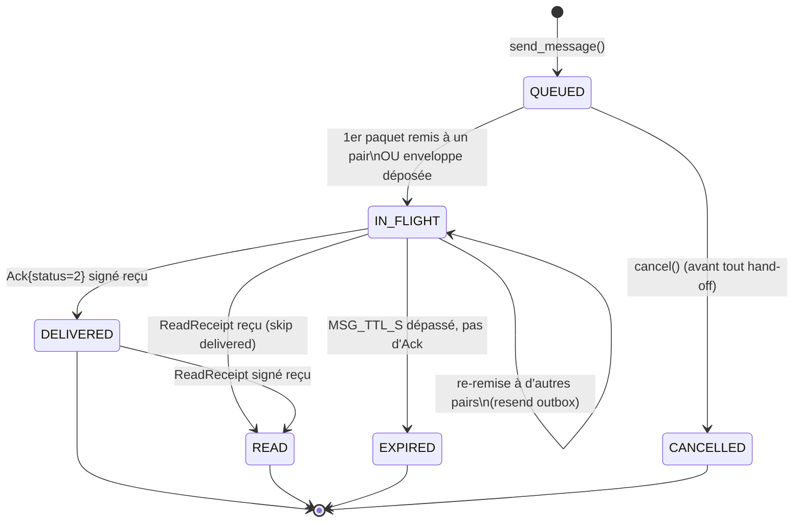
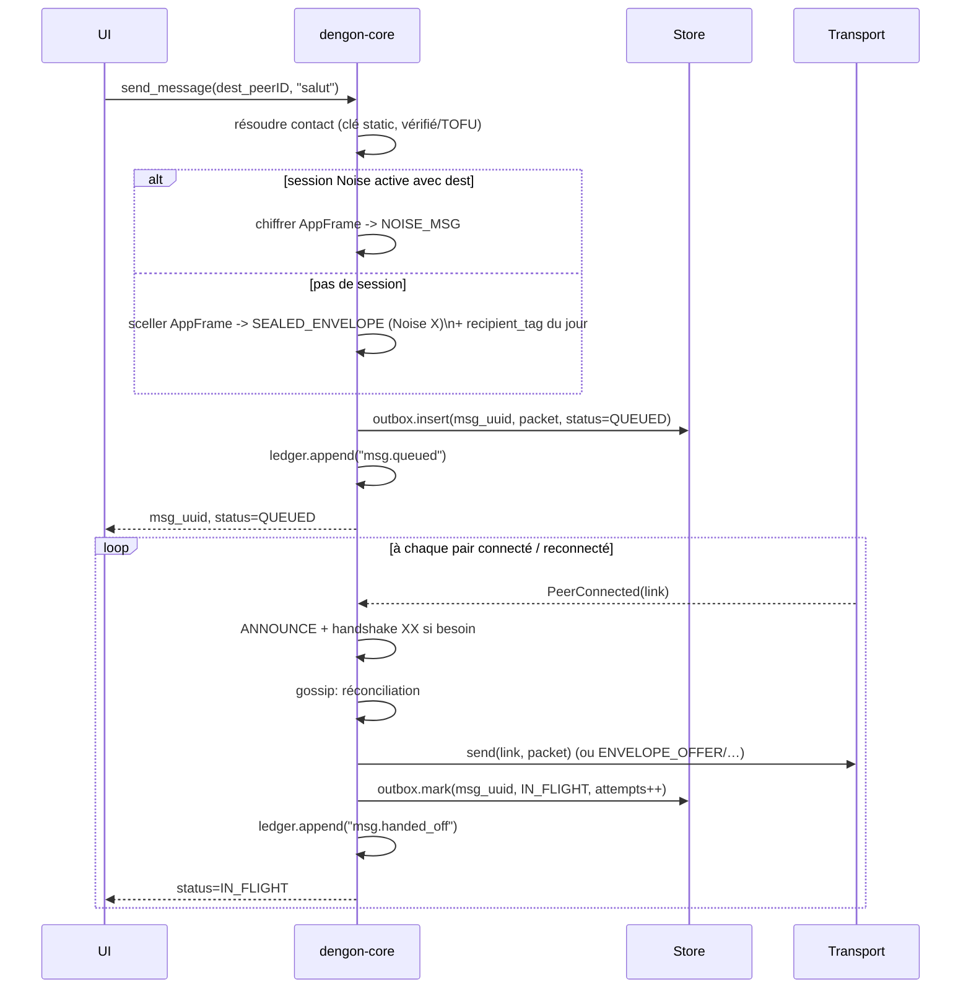
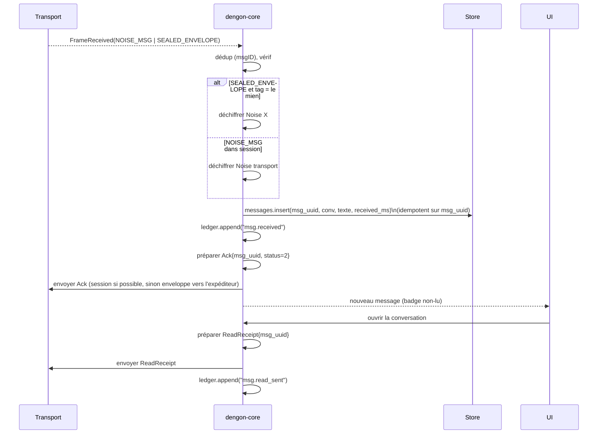
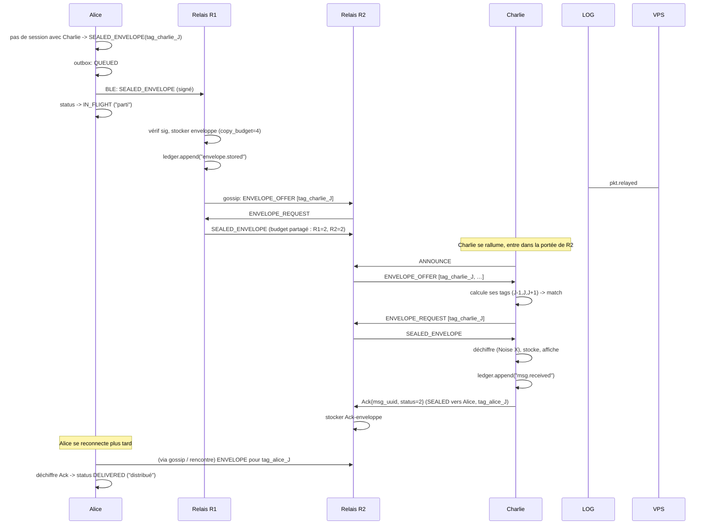
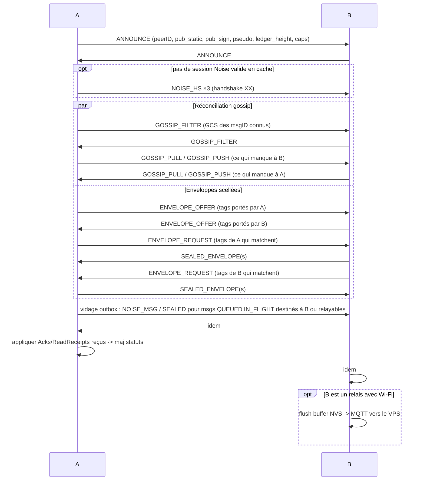

# Cycle de vie d'un message & statuts

## 1. Les statuts

| Statut (UI) | Code interne | Signification précise | Événement journal |
| --- | --- | --- | --- |
| **En attente** | `QUEUED` | Créé, chiffré, dans l'outbox local. **Remis à aucun** pair/relais. | `msg.queued` |
| **Parti** | `IN_FLIGHT` | Remis à ≥ 1 relais/pair **ou** enveloppe scellée déposée. Sur le réseau, pas encore chez le destinataire. | `msg.handed_off` |
| **Distribué** | `DELIVERED` | **ACK signé** de l'appareil destinataire reçu (le message est arrivé sur son téléphone). | `msg.delivered` |
| **Lu** | `READ` | **Read-receipt signé** du destinataire reçu (l'utilisateur a ouvert la conversation). | `msg.read` |
| *(Échec)* | `EXPIRED` | `MSG_TTL_S` (24 h) écoulé sans `DELIVERED`, budget de copies épuisé. | `msg.expired` |
| *(Annulé)* | `CANCELLED` | L'expéditeur retire le message avant `IN_FLIGHT`. | `msg.cancelled` |

Notes :

- Le suivi porte sur le **`msg_uuid`** (stable de bout en bout), pas le `msgID` L3
  (qui change si le paquet est re-scellé). Cf. `03-network-protocol.md` §4.1.
- « Parti » ≠ « le destinataire a le message ». C'est « le réseau s'en occupe ».
- Les transitions sont **monotones** : on ne revient jamais en arrière
  (`QUEUED → IN_FLIGHT → DELIVERED → READ`). Un ACK en double est ignoré.
- **Lu implique distribué** : recevoir un read-receipt sans avoir vu l'ACK fait
  passer directement `IN_FLIGHT → READ` (et journalise `msg.delivered` +
  `msg.read`).

---

## 2. Machine à états

Implémentation : `dengon-core::sync::status`. Une seule fonction
`apply_event(msg_uuid, ev) -> Option<StatusChange>` ; toute mutation passe par elle
et journalise (`ledger.append`).

---

## 3. Émission (expéditeur)

**Outbox** (`store.outbox`) : `{ msg_uuid, dest_peerID, packet_bytes, status,
attempts, first_sent_ms, last_sent_ms, expires_ms }`.

Règles de rejeu :

- à **chaque** `PeerConnected`, on rejoue tous les `QUEUED`/`IN_FLIGHT` non expirés
  dont le pair est destinataire **ou** bon candidat relais ;
- `attempts` plafonné (`RESEND_MAX = 8`) par pair, mais illimité dans le temps tant
  que `expires_ms` n'est pas atteint ;
- à réception d'un `Ack{status=2}` → `DELIVERED`, on **retire** de l'outbox les
  copies encore en circulation (best-effort : `GOSSIP` propagera l'absence).

---

## 4. Réception (destinataire)

- L'`Ack` et le `ReadReceipt` sont eux-mêmes soumis au **store-and-forward** : si
  l'expéditeur est déconnecté, ils partent en `SEALED_ENVELOPE` adressée à lui, ou
  attendent dans l'outbox du destinataire.
- `messages.insert` est **idempotent** sur `msg_uuid` : recevoir le même message par
  deux chemins n'affiche qu'un exemplaire et n'émet qu'un `Ack`.

---

## 5. Cas multi-saut avec relais absent du destinataire

Scénario : **Alice → Charlie**, Charlie éteint. Relais R1, R2 (ESP32).

Statut vu par Alice : `en attente → parti` (dès R1) `→ distribué` (quand l'Ack de
Charlie la rattrape). `lu` suivra pareil si Charlie ouvre la conversation.

Le **dashboard** voit : `msg.handed_off` (Alice, opt-in) → `pkt.relayed` (R1) →
`pkt.relayed`/`envelope.handoff` (R2) → `envelope.delivered` (R2, quand Charlie
récupère) → `ack.observed`. Il reconstruit `parti → distribué`.

---

## 6. Reconnexion — séquence complète

Quand un lien BLE s'établit entre **A** et **B** (peu importe qui est « client ») :

C'est **le** mécanisme qui rend « la déconnexion non bloquante » :

- ce qui **m'était destiné et que je n'ai pas** → je le récupère (gossip + enveloppes) ;
- ce que **je n'ai pas pu transmettre** → je le repousse (vidage d'outbox) ;
- les **accusés en retard** → ils me rattrapent et mes statuts avancent.

---

## 7. Expiration & nettoyage

| Élément | Règle | Effet |
| --- | --- | --- |
| Message outbox | `now > expires_ms` (24 h) sans `DELIVERED` | statut `EXPIRED`, `ledger.append("msg.expired")`, UI « non remis » + bouton renvoyer |
| Enveloppe scellée (chez un porteur) | budget = 0 **et** `now > deposit_ms + MSG_TTL_S` | suppression silencieuse |
| Entrée seen-set | `now > seen_ms + SEEN_TTL_S` | éviction (permet un renvoi légitime ultérieur) |
| Fragment partiel | `now > FRAG_TIMEOUT_S` d'inactivité | abandon |
| Session Noise | lien BLE perdu | oubliée (nouvelle FS à la reconnexion) |
| Cache gossip public | `now > 6 h` | éviction (fenêtre de sync) |

---

## 8. Ordre & cohérence par conversation

- `conv_seq` (compteur par conversation, par expéditeur) permet au destinataire de
  détecter un **trou** (`… 41, 43 …` → il manque 42) et de le demander explicitement
  via `GOSSIP_PULL` au prochain contact.
- L'affichage ordonne par `sent_ms` ; en cas d'égalité, par `conv_seq`.
- Pas d'ordre **global** entre conversations différentes (inutile, cf.
  `01-benchmarks.md` §1.3).

---

## 9. Table : événement UI ↔ paquet ↔ log

| Action utilisateur / système | Paquet(s) émis | Statut | Événement(s) VPS |
| --- | --- | --- | --- |
| Rédige + envoie | — | `QUEUED` | `msg.queued` (opt-in) |
| 1er pair reçoit le paquet | `NOISE_MSG` / `SEALED_ENVELOPE` | `IN_FLIGHT` | `msg.handed_off` (opt-in), `pkt.relayed` (relais) |
| Relais transporte | `GOSSIP_PUSH` / `ENVELOPE_*` | — | `pkt.relayed`, `envelope.stored`, `envelope.handoff` |
| Destinataire reçoit | `ACK{status=2}` | `DELIVERED` (à l'arrivée de l'ACK) | `ack.observed`, `envelope.delivered` |
| Destinataire ouvre la conv | `ReadReceipt` | `READ` | `read.observed` |
| 24 h sans ACK | — | `EXPIRED` | `msg.expired` (opt-in) |
