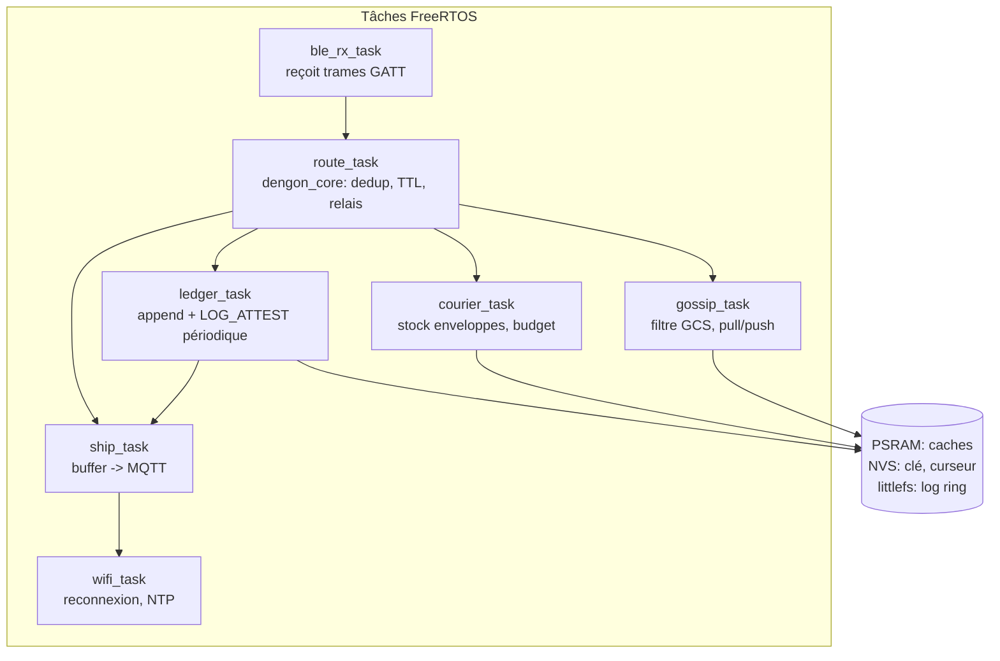

# Relais ESP32 — `dengon-relay`

## 1. Rôle

Le relais est de l'**infrastructure fixe** : branché au secteur, posé en hauteur,
toujours allumé. Il densifie le maillage et sert de **mémoire tampon** du réseau.

| Fonction | Détail |
| --- | --- |
| **Relayer** | reçoit des paquets BLE, applique le pipeline de routage (`03` §7.1), rediffuse |
| **Cacher (gossip)** | garde en RAM/PSRAM les messages publics et paquets récents (fenêtre 6 h) pour la réconciliation |
| **Déposer (courier)** | stocke les `SEALED_ENVELOPE` pour destinataires absents, gère le budget de copies |
| **Attester** | tient son propre journal chaîné, diffuse `LOG_ATTEST` |
| **Remonter les logs** | Wi-Fi station → MQTT/TLS → VPS ; buffer en flash si Wi-Fi coupé |

Le relais **ne déchiffre rien** : il n'a aucune clé utilisateur. Il ne voit que des
paquets chiffrés + des métadonnées de passage.

---

## 2. Matériel

| Élément | Choix | Raison |
| --- | --- | --- |
| Module | **ESP32-WROVER-E** (4 Mo flash, 8 Mo PSRAM) | buffers messages + enveloppes + coexistence BLE/Wi-Fi |
| Alt. prototype | ESP32-WROOM-32 | OK pour démo, PSRAM absente → buffers réduits, débit BLE+Wi-Fi plus faible |
| Alimentation | USB 5 V / secteur | fixe, pas de contrainte batterie |
| Antenne | PCB ou U.FL externe | portée ; U.FL recommandé en déploiement réel |
| Stockage persistant | flash interne (partition NVS + partition `spiffs`/`littlefs` pour le buffer de logs) | survie aux coupures |

**Pas de** : LoRa, écran, batterie (hors périmètre MVP).

---

## 3. Stack firmware

```
ESP-IDF v5.x
├── NimBLE (host BLE)                    → rôle GATT double (serveur + client)
├── esp-wifi (station)                   → connexion au réseau du site
├── esp-mqtt (mqtts, TLS)                → publication des logs
├── nvs_flash (chiffré, eFuse)           → clé de relais, config, curseur de journal
├── littlefs                             → buffer de logs hors-ligne (ring)
└── components/dengon_core_ffi/
        └── libdengon_core.a  (Rust, no_std+alloc, cross-compilé xtensa)
             → protocol, routing/dedup, gossip, ledger
        └── crypto : mbedTLS (déjà dans IDF) OU port libsodium — décision lot 0
```

### Réutilisation de `dengon-core`

- `protocol`, `sync::routing`, `sync::gossip`, `ledger`, `observability` compilent en
  `no_std` + `alloc` → archivés en `libdengon_core.a`, exposés au C via un header
  `dengon_core.h` (généré par `cbindgen`).
- `store` : implémentation `Store` spécifique ESP32 (index en PSRAM, persistance NVS
  pour le curseur de journal et les enveloppes critiques).
- `crypto` : si `snow` + `ed25519-dalek` cross-compilent proprement pour xtensa
  (`getrandom` → source ESP32) → on garde tout en Rust. Sinon, trait `Crypto`
  implémenté côté C avec mbedTLS/libsodium. **Spike obligatoire au lot 0.**

### Coexistence BLE + Wi-Fi

- Wi-Fi en **mode station uniquement** (la coexistence radio n'est supportée qu'en
  STA).
- Débit combiné modeste : c'est acceptable, le relais BLE prime, le MQTT est
  bufferisé et envoyé par petits lots.
- PSRAM requise pour des buffers BLE confortables quand le Wi-Fi tourne.

---

## 4. Architecture logicielle interne



Files inter-tâches : `xQueue` bornées (backpressure : si `route_task` sature, on
**droppe des paquets entrants** — jamais des enveloppes déjà acceptées).

---

## 5. Budgets mémoire (cible WROVER)

| Poste | Taille | Note |
| --- | --- | --- |
| Cache gossip (paquets récents) | ~512 Ko PSRAM | ~1000 paquets, éviction LRU + 6 h |
| Enveloppes scellées stockées | ~1 Mo PSRAM + persistance NVS des N plus récentes | plafond configurable (`ENVELOPE_STORE_MAX = 512`) |
| Seen-set (dedup) | ~48 Ko | 1024 × (32 o hash + méta) |
| Réassemblage fragments | ~256 Ko | `FRAG_MAX_CONCURRENT` × 4 Ko |
| Buffer de logs hors-ligne | littlefs, ~512 Ko partition | ring : écrase le plus ancien si plein |
| Pile NimBLE + Wi-Fi | ~64 Ko SRAM | |

Si WROOM (pas de PSRAM) : diviser les caches par ~8, `ENVELOPE_STORE_MAX = 64`.

---

## 6. Connexion au VPS

### 6.1 Provisioning

1. À la fabrication : `idf.py` flashe le firmware, active **flash encryption** +
   **secure boot**.
2. Premier boot : génère la paire Ed25519 du relais en NVS chiffrée.
3. Config Wi-Fi + URL du broker : via `esp_wifi` provisioning BLE (SoftAP désactivé)
   ou fichier de conf flashé.
4. L'opérateur enregistre `relay_id` + `pub_sign` + certificat client dans le
   dashboard (liste blanche).

### 6.2 MQTT

| Paramètre | Valeur |
| --- | --- |
| Broker | `mqtts://<vps>:8883` |
| Auth | mTLS (cert client par relais) ; fallback JWT signé |
| Topic logs | `dengon/logs/<relay_id>` |
| Topic attest | `dengon/attest/<relay_id>` |
| Topic santé | `dengon/health/<relay_id>` (uptime, RSSI moyen, tailles de buffers, version fw) toutes les 60 s |
| QoS | 1 (au moins une fois ; le VPS déduplique sur `event_id`) |
| Payload | JSON canonique signé (cf. `08-observability-events.md`) — batch de N événements |
| Hors-ligne | accumulation dans le ring littlefs ; flush FIFO à la reconnexion, débit limité |

### 6.3 Horloge

NTP au boot + resync toutes les heures. Les événements portent `ts_ms` local ; le VPS
ajoute `ingested_ms` et signale les dérives (`node.clock_skew`).

---

## 7. Comportement en cas de panne

| Panne | Comportement |
| --- | --- |
| Wi-Fi coupé | relais BLE continue normalement ; logs bufferisés ; retry Wi-Fi backoff |
| Broker injoignable | idem ; buffer ring |
| Buffer de logs plein | on écrase les plus anciens logs (le routage prime) ; compteur `logs_dropped` remonté ensuite |
| PSRAM saturée | éviction LRU du cache gossip ; refus de **nouvelles** enveloppes (les existantes protégées) ; `ledger.append("relay.overloaded")` |
| Redémarrage | recharge clé + curseur de journal depuis NVS ; le journal **reprend à `seq` suivant** (continuité de chaîne préservée) ; caches volatils repartent vides |
| Reset d'usine | nouvelle identité de relais → doit être ré-enregistré au dashboard |

---

## 8. Ce que le relais journalise (chaîne locale + envoi VPS)

Voir catalogue complet dans `08-observability-events.md`. Principaux :

- `pkt.seen`, `pkt.relayed`, `pkt.dropped` (raison), `pkt.rejected` (sig invalide)
- `envelope.stored`, `envelope.handoff`, `envelope.delivered`, `envelope.expired`
- `peer.connected`, `peer.disconnected` (avec RSSI, `peerID` du pair)
- `attest.emitted` (sa propre racine), `attest.observed` (racine d'un autre nœud)
- `relay.boot`, `relay.overloaded`, `relay.wifi_up`, `relay.wifi_down`
- `node.clock_skew`

**Jamais** : contenu, `msg_uuid`, `recipient` identifiable. Le `msgID` est **haché**
avant émission.

---

## 9. Tests firmware

Cf. `11-testing-strategy.md` §5 : tests unitaires de `libdengon_core` sur host,
tests d'intégration sur banc (2-3 ESP32 + 1 téléphone + broker MQTT local),
test de charge (injecter X paquets/s), test de coupure Wi-Fi, test de redémarrage
(continuité de chaîne).
