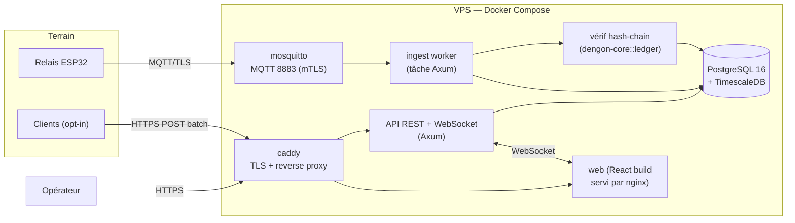
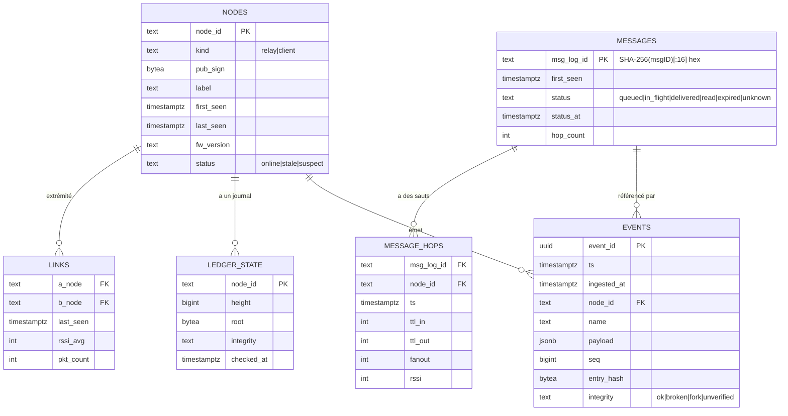
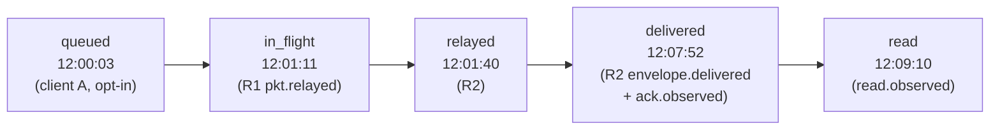

# Dashboard d'observabilité

## 1. Principe

Le dashboard **observe** le réseau. Il ne transporte aucun message, ne détient
aucune clé utilisateur, ne peut rien injecter dans le maillage. S'il tombe, la
messagerie continue à l'identique.

Il reçoit des **événements de métadonnées signés** (des relais, et des clients qui
l'acceptent explicitement), les vérifie, les stocke, et les restitue sous forme de
vues : parcours d'un message, santé du réseau, état de la flotte, intégrité des
journaux.

---

## 2. Architecture



| Service | Techno | Rôle |
| --- | --- | --- |
| `caddy` | Caddy 2 | TLS auto (Let's Encrypt), reverse-proxy, rate-limit |
| `mosquitto` | Eclipse Mosquitto 2 | broker MQTT, auth mTLS, ACL par topic |
| `api` | **Rust + Axum** | ingest worker (client MQTT) + REST + WebSocket + vérif chaîne |
| `db` | PostgreSQL 16 + TimescaleDB | hypertable événements + tables relationnelles |
| `web` | React + TS + Vite, servi par nginx | UI opérateur |

Le backend en Rust **réutilise `dengon-core`** : mêmes structs d'événements
(`observability`), même code de vérification de journal (`ledger::verify_chain`),
mêmes constantes.

---

## 3. Ingestion

### 3.1 Sources

| Source | Canal | Auth | Volume |
| --- | --- | --- | --- |
| Relais | MQTT `dengon/logs/<relay_id>`, `dengon/attest/*`, `dengon/health/*` | mTLS | élevé, continu |
| Client opt-in | `POST /ingest/batch` (HTTPS) | token éphémère lié au `peerID` | faible, sporadique |

### 3.2 Pipeline

```
message MQTT (batch JSON signé)
  → parse + schéma (rejette si malformé)
  → vérif signature Ed25519 (clé = pub_sign du nœud, doit être en liste blanche)
  → dédup sur event_id (SHA-256(node ‖ seq))
  → si event de journal : chaîner (prev_hash == hash(seq-1) ?) → statut d'intégrité
  → INSERT hypertable `events`
  → mise à jour des projections (voir §5) : messages, nodes, links
  → push WebSocket aux opérateurs connectés (filtré)
```

Idempotent : rejouer un batch (QoS 1) ne crée pas de doublon.

### 3.3 Ce qui est refusé

- signature invalide → `events` avec `flag=rejected_sig`, alerte ;
- `node` inconnu (pas en liste blanche) → quarantaine, alerte ;
- `msgID` non haché (format brut détecté) → rejet strict (protection anti-fuite).

---

## 4. Modèle de données (résumé — détail dans `09-data-model.md`)



- `events` = **hypertable Timescale** (partition par temps), rétention configurable.
- Les autres tables sont des **projections** entretenues par l'ingest (pour des
  requêtes rapides) — reconstructibles en rejouant `events`.

---

## 5. Écrans

### 5.1 Parcours d'un message

Entrée : un `msg_log_id` (l'app peut afficher un QR/lien « suivre ce message » qui
contient déjà le hash) **ou** recherche par fenêtre de temps + `peerID` de relais.

Affiche :

- **timeline verticale** : chaque saut (`MESSAGE_HOPS`) avec nœud, horodatage, TTL
  in/out, fanout, RSSI ;
- **statut courant** reconstruit : `en attente → parti → distribué → lu` avec
  l'horodatage de chaque transition et la **source** de l'info (quel événement,
  quel nœud) ;
- **carte mini** du chemin pris ;
- badges d'intégrité (tous les événements de ce message proviennent-ils de journaux
  vérifiés ?).



### 5.2 Carte / santé du réseau

- graphe force-directed des `NODES` + `LINKS` (relais en gros, clients agrégés) ;
- couleur = statut (`online` / `stale` / `suspect`) ;
- épaisseur d'arête = trafic ; opacité = fraîcheur ;
- panneau latéral : densité moyenne, latence de relais médiane, taux de livraison
  (messages passés `delivered` / vus `in_flight`), nb d'enveloppes en circulation
  (estimé).

### 5.3 Flotte de relais

Tableau : `relay_id`, label, version fw, uptime, RSSI moyen, tailles de buffers
(gossip / enveloppes / logs), `logs_dropped`, dernière remontée, statut secure
boot/flash-enc. Alertes : relais muet > 5 min, buffer > 90 %, version obsolète.

### 5.4 Intégrité des journaux

Par nœud : hauteur, racine courante, dernier contrôle, verdict
(`ok` / `chain_broken` / `fork_detected` / `unverified`). Vue « diff » quand un fork
est détecté (deux racines pour la même hauteur, avec les relais qui ont rapporté
chacune).

### 5.5 Recherche de logs

Filtre plein-texte sur `events` (name, node, payload jsonb), fenêtre temporelle,
export CSV/JSON.

### 5.6 Alerting

Règles (configurables) → notif (webhook / e-mail) :

| Alerte | Condition |
| --- | --- |
| `relay_silent` | pas de `health` d'un relais depuis 5 min |
| `chain_broken` | `events.integrity = broken` |
| `fork_detected` | 2 racines pour (node, height) |
| `rejected_sig_spike` | > N signatures invalides / min |
| `delivery_drop` | taux de livraison < seuil sur 15 min |
| `clock_skew` | dérive d'horloge d'un nœud > 2 min |

---

## 6. API (Axum) — principales routes

| Méthode | Route | Rôle |
| --- | --- | --- |
| `POST` | `/ingest/batch` | ingestion clients opt-in (token) |
| `GET` | `/api/messages/:msg_log_id` | parcours + statut + sauts |
| `GET` | `/api/messages?since=&node=&status=` | liste filtrée |
| `GET` | `/api/network/graph` | nœuds + liens (snapshot) |
| `GET` | `/api/nodes` / `/api/nodes/:id` | flotte |
| `GET` | `/api/integrity` | verdicts par nœud |
| `GET` | `/api/events?…` | recherche de logs |
| `WS` | `/api/stream` | flux temps réel (events, transitions de statut, alertes) |
| `POST` | `/api/nodes` (admin) | enregistrer un relais (pub_sign, cert) |
| `GET` | `/healthz` | liveness |

Auth : session opérateur (cookie httponly + CSRF) ; rôles `viewer` / `admin`.

---

## 7. Déploiement sur le VPS existant

```
dashboard/deploy/
├── docker-compose.yml     # caddy, mosquitto, api, db, web
├── Caddyfile
├── mosquitto/             # mosquitto.conf, acl, ca/
├── migrations/            # SQL (sqlx migrate)
└── .env.example
```

Étapes :

1. `docker compose up -d db` → `sqlx migrate run`.
2. Générer la CA MQTT + certs relais (`deploy/mosquitto/gen-certs.sh`).
3. `docker compose up -d` (le reste).
4. Caddy obtient le certificat TLS pour `dashboard.<domaine>`.
5. Enregistrer chaque relais via `POST /api/nodes` (ou script de seed).
6. Créer le compte opérateur admin (CLI `api seed-admin`).

Ressources : léger (< 1 Go RAM hors Postgres ; Postgres selon rétention). Compatible
avec un VPS modeste.

---

## 8. Confidentialité — garanties du dashboard

- **Aucun** contenu de message, **aucun** `msg_uuid`, **aucun** `recipient`
  identifiable ne peut arriver ni être stocké (rejet au schéma).
- `msgID` toujours **haché** (`SHA-256(msgID)[:16]`) → impossible de remonter au
  message sans déjà le connaître.
- Les pseudos n'apparaissent que si un nœud les publie volontairement (opt-in).
- Rétention bornée + purge automatique.
- Le dashboard est **read-only vis-à-vis du terrain** : pas de route d'écriture vers
  les nœuds.
