# Périmètre MVP & feuille de route

## 1. Definition of Done du MVP

Le MVP est atteint quand, sur du **vrai matériel** :

1. Deux téléphones Android à portée échangent un message texte chiffré, avec
   passage des statuts **en attente → parti → distribué → lu**.
2. Un 3ᵉ appareil hors de portée est joint via **au moins un relais ESP32**.
3. Un destinataire **éteint** reçoit son message à son retour (enveloppe scellée) ;
   l'expéditeur, **déconnecté** entre-temps, voit ses statuts se mettre à jour à sa
   reconnexion.
4. Le **dashboard** (déployé sur le VPS) montre le parcours du message, la carte du
   réseau, l'état des relais, et **détecte une altération** de journal simulée.
5. Contact établi par **QR + code de vérification** ; changement de clé détecté.
6. Sécurité : E2E vérifié (un relais capturé ne révèle aucun clair), `cargo audit`
   propre, revue crypto tierce passée.
7. CI verte : tests `dengon-core`, simulateur multi-nœuds, build des 4 cibles
   (core, node, android, firmware), lint dashboard.

---

## 2. Lots de livraison

Chaque lot est livrable et testable indépendamment. Ordre = dépendances.

### Lot 0 — Fondations & spikes (dérisquage)

- Workspace Rust, CI de base, conventions.
- **Spike A** : `dengon-core` (`protocol` + `crypto`) cross-compile-t-il pour
  xtensa-esp32 ? → décide « crypto en Rust » vs « trait `Crypto` + mbedTLS ».
- **Spike B** : `btleplug` en rôle **peripheral** sur Linux (annonce service +
  notify) — valider le double rôle GATT.
- **Spike C** : Android `BluetoothGattServer` + scan en foreground service, 2
  appareils échangent 20 o.
- Livrable : rapport de décision + squelette des crates.

### Lot 1 — `dengon-core` : protocole & crypto

- `protocol` : encode/decode paquets (§3), fragmentation L2, tests round-trip +
  property tests.
- `crypto` : Ed25519, Noise `XX`, Noise `X`, `recipient_tag`, padding.
- `identity` : keypair, QR, code de vérification.
- `ledger` : append + `verify_chain` + export.
- Tests : vecteurs Noise, forge de signature rejetée, chaîne rompue détectée.

### Lot 2 — `dengon-core` : store & sync

- `store` : impl SQLite complète (§9 du data-model).
- `sync::routing` : pipeline §7.1 (dedup, TTL, jitter, relais).
- `sync::gossip` : GCS, pull/push, réconciliation.
- `sync::status` : machine à états (§5), outbox, rejeu.
- `sync::courier` : dépôt/collecte d'enveloppes, budget de copies.
- `observability` : catalogue d'événements + JSON canonique.
- Tests : unitaires par module.

### Lot 3 — `dengon-sim` + `dengon-node`

- `dengon-sim` : N instances de core reliées par un **transport en mémoire**
  scriptable (latence, perte, partition, churn).
- Scénarios rejoués : envoi direct, multi-saut, destinataire absent, expéditeur
  déconnecté, partition puis fusion, flood.
- `dengon-node` : binaire CLI (transport `btleplug`), sert aux tests inter-machines
  et de nœud fixe.
- **Jalon** : les 5 scénarios du DoD passent en simulation.

### Lot 4 — `dengon-ffi` + app Android

- `dengon-ffi` : surface UniFFI (`send_message`, `poll_events`, `on_peer_*`,
  `mark_read`, `verify_contact`, …).
- `AndroidTransport` (Kotlin + JNI) : GATT server + scanner + foreground service.
- UI Compose : liste de conversations, fil, saisie, statuts, écran QR + vérification,
  écran « réseau » (pairs visibles).
- **Jalon** : 2 téléphones + 1 `dengon-node` → scénarios 1 et partiellement 2.

### Lot 5 — Firmware `dengon-relay`

- ESP-IDF + NimBLE, `libdengon_core.a` liée (selon décision Lot 0).
- Tâches : route, gossip, courier, ledger, ship.
- Client MQTT/TLS + buffer littlefs.
- Provisioning (clé relais, Wi-Fi, broker).
- **Jalon** : scénarios 2 et 3 du DoD sur vrai matériel.

### Lot 6 — Dashboard

- `api` (Axum) : ingest MQTT + vérif hash-chain + REST + WebSocket.
- Migrations Postgres/Timescale.
- `web` (React) : parcours message, carte réseau, flotte, intégrité, recherche,
  alerting.
- `deploy` : docker-compose + Caddy + Mosquitto, déployé sur le VPS.
- **Jalon** : scénario 4 du DoD.

### Lot 7 — Durcissement produit

- Chiffrement base au repos, quotas anti-DoS, gestion fine des erreurs.
- Revue crypto tierce ; `cargo deny`, SBOM.
- OTA firmware signé, Secure Boot sur cartes de prod.
- Doc d'exploitation, runbook d'incident.
- Tests de charge (densité 20+ nœuds), tests de terrain.

---

## 3. Explicitement hors MVP

| Fonction | Pourquoi reporté | Prévu par l'archi ? |
| --- | --- | --- |
| App **iOS** | BLE périphérique/fond bridé, effort natif conséquent | oui (core + UniFFI/Swift) |
| **Groupes / canaux publics** de diffusion | complexité (MLS ou signatures de canal), pas dans le brief | partiellement (type de paquet réservable) |
| **Pièces jointes** (images/fichiers) | débit BLE, fragmentation lourde, stockage | oui (fragmentation L2 déjà là) |
| **Double Ratchet** (Signal) pour le canal privé | Noise suffit au MVP ; gain = PCS renforcé | oui (couche `crypto` isolée) |
| Firmware relais **en Rust pur** (`esp-rs`) | écosystème BLE encore jeune | oui (même `dengon-core`) |
| **Backhaul par le VPS** (relai internet entre îlots) | choix explicite « observabilité seule » | non (rupture du modèle de confiance) |
| **Panic wipe / déni plausible** | durcissement avancé | oui |
| Multi-appareil pour un même compte | synchro d'état complexe | non (v2) |

---

## 4. Risques & mitigations

| Risque | Impact | Mitigation |
| --- | --- | --- |
| `dengon-core` ne cross-compile pas pour ESP32 | firmware plus coûteux | Spike Lot 0 ; trait `Crypto`/`Store` déjà prévu pour découpler ; repli mbedTLS |
| BLE périphérique instable selon OEM Android | maillage dégradé sur certains téléphones | matrice d'appareils testés ; `dengon-node` comme relais mobile d'appoint ; relais ESP32 densifient |
| Coexistence BLE+Wi-Fi sur ESP32 = débit faible | remontée de logs lente | WROVER + PSRAM ; batch MQTT ; logs = best-effort par nature |
| Faux relais / pollution d'enveloppes | DoS stockage | signature obligatoire des `SEALED_ENVELOPE` ; quotas ; budget de copies |
| Analyse de trafic par corrélation | fuite de métadonnées | padding, tags tournants ; limite documentée (adversaire global hors périmètre) |
| Dérive d'horloge des nœuds | statuts/latences faux | NTP relais ; fenêtre de tolérance ; alerte `clock_skew` |
| Charge dashboard si réseau grandit | perte d'événements | Timescale + rétention + agrégats ; QoS 1 + dédup ; les logs ne sont pas critiques |
| Périmètre qui gonfle (groupes, fichiers…) | MVP jamais fini | ce document fait foi ; tout ajout = après Lot 7 |

---

## 5. Séquencement indicatif

```mermaid
gantt
    dateFormat X
    axisFormat %s
    section Core
    Lot 0 spikes           :a0, 0, 2
    Lot 1 proto+crypto     :a1, after a0, 3
    Lot 2 store+sync       :a2, after a1, 4
    section Intégration
    Lot 3 sim+node         :a3, after a2, 2
    Lot 4 android          :a4, after a3, 3
    Lot 5 firmware esp32   :a5, after a3, 3
    section Observabilité
    Lot 6 dashboard        :a6, after a2, 4
    section Produit
    Lot 7 durcissement     :a7, after a5, 3
```

Unités volontairement abstraites (« blocs de travail ») : à convertir en semaines
selon la taille et la disponibilité de l'équipe. Lots 5 et 6 parallélisables après
le Lot 3.
